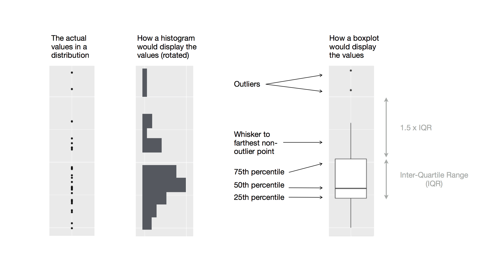

# First Graph {#sec-day-1-first-graph}

```{r}
#| echo: false
source("_common.R")
```

We're going to jump right into a data science project. You won't get all the details this first time through, but that's ok – let's just see the general flow of things.

For this first project wer'e going to use an R package called **ggplot2** – it's the main way folks who use R generate graphs and images.

We will start by creating a simple scatterplot and use that to introduce aesthetic mappings and geometric objects -- the fundamental building blocks of ggplot2. We will then walk you through visualizing distributions of single variables as well as visualizing relationships between two or more variables. We'll finish off with saving your plots and troubleshooting tips.

### Prerequisites

This chapter focuses on ggplot2. To access the datasets, help pages, and functions used in this chapter, load ggplot2:

```{r}
#| label: setup
library(ggplot2)
```

That one line of code loads ggplot2, letting R know that we'll be using it to create data visualizations.

I've setup this project to already have ggplot2 installed and ready to load. But if you run this code and get the error message `there is no package called 'tidyverse'`, you'll need to first install it, then run `library()` once again.

```{r}
#| eval: false
install.packages("ggplot2")
library(ggplot2)
```

You only need to install a package once, but you need to load it every time you start a new session.

In addition to tidyverse, we will also use the **eammi2** dataset. This is data from the "Emerging Adulthood Measured at Multiple Institutions 2" project. This project surveyed 4,220 college students at 32 different academic institutions across the U.S (of whom, 3,134 gave valid responses that could be analyzed). The data for this project was publicly posted on the Open Science Framework here: <https://osf.io/qtqpb/>. A paper (Grahe et al., 2018) describing what was measured and why is here: <https://openpsychologydata.metajnl.com/articles/10.5334/jopd.38>

The eammi2 project was quite extensive, measuring many different variables, including:

- *Happiness* - which psychologists call Subjective Well Being. Participants rated their happiness on 6 different items on a scale from 1-7. Each participant's happiness level is in SWBScale

- *Mindfulness* \[[15](https://openpsychologydata.metajnl.com/articles/10.5334/jopd.38#B15)\] (15 items). Each participant's overall mindfullness scores is in MindfulnessScale

- *Social media use*: This was measured in a couple of ways, with overall intensity of use in SocialMediaSum

- *Markers of Adulthood* (MOA; items derived from \[[11](https://openpsychologydata.metajnl.com/articles/10.5334/jopd.38#B11)\], \[[12](https://openpsychologydata.metajnl.com/articles/10.5334/jopd.38#B12)\]; importance, 20 items; achieve, 20 items; adulthood, 1 item),

- *IDEA-8* \[[13](https://openpsychologydata.metajnl.com/articles/10.5334/jopd.38#B13)\] (8 items),

- *Political Affiliation* (party identification, 1 item; political ideology, 1 item;

- *Presidential Preference, 1* item),

- *Mindfulness* \[[15](https://openpsychologydata.metajnl.com/articles/10.5334/jopd.38#B15)\] (15 items),

- *Need to Belong* \[[16](https://openpsychologydata.metajnl.com/articles/10.5334/jopd.38#B16)\] (10 items),

- *Efficacy* \[[17](https://openpsychologydata.metajnl.com/articles/10.5334/jopd.38#B17)\] (8 items),

- *Perceived Social Support* \[[18](https://openpsychologydata.metajnl.com/articles/10.5334/jopd.38#B18)\] (12 items),

- *Social Media Use Scale* (adapted from \[[19](https://openpsychologydata.metajnl.com/articles/10.5334/jopd.38#B19)\], \[[20](https://openpsychologydata.metajnl.com/articles/10.5334/jopd.38#B20)\], maintaining existing connections, 5 items; making new connections, 4 items; information, 2 items),

- *American Dream* (importance of achieving, 1 item; ability to achieve; 1 item),

- *Interpersonal Transgressions* (exploratory items adapted from \[[21](https://openpsychologydata.metajnl.com/articles/10.5334/jopd.38#B21)\], 12 items),

- *Narcissistic Personality Inventory-13* (NPI-13; \[[22](https://openpsychologydata.metajnl.com/articles/10.5334/jopd.38#B22)\], 13 items),

- *Interpersonal Exploitativeness Scale* \[[23](https://openpsychologydata.metajnl.com/articles/10.5334/jopd.38#B23)\], (3 items),

- *Disability Identity* (one dichotomous item assessing participants’ self-perception as “disabled” and six dichotomous items assessing the presence or absence of a disability in a variety of areas; including physical, sensory, learning, psychiatric, chronic health, and other;

- *Personal Opinions Questionnaire*, POQ; \[[24](https://openpsychologydata.metajnl.com/articles/10.5334/jopd.38#B24)\], 15 items),

- *Patient Health Questionnaire* \[[25](https://openpsychologydata.metajnl.com/articles/10.5334/jopd.38#B25)\], (13 items),

- *Perceived Stress Questionnaire* \[[26](https://openpsychologydata.metajnl.com/articles/10.5334/jopd.38#B26)\], (10 items),

- *Marriage Opinions* (Central identity, Marital Salience, Marital Timing, Marital Permanence, adapted from \[[27](https://openpsychologydata.metajnl.com/articles/10.5334/jopd.38#B27)\], \[[28](https://openpsychologydata.metajnl.com/articles/10.5334/jopd.38#B28)\] (5 items),

- demographics (school attended, sex, age, education, sibling, race, armed services (2 items), income, and Residency (3 items).

We are going to obtain the eammi2 data set using the download.file command in R. We will then read into memory using the read.csv command, calling it eammi2.

```{r}
download.file("https://github.com/rcalinjageman/r_crash_course/raw/refs/heads/main/data/EAMMi2-CleanData.csv", "EAMMi2-CleanData.csv")
eammi2 <- read.csv("EAMMi2-CleanData.csv")
```

```{r}
#| include: false
file.remove("EAMMi2-CleanData.csv")
```

## First steps

Does being mindful correlate with being a happier person? Does lots of social media correlate with being less happy? Are these relationships different depending on the gender soeone identifies with? Let's create visualizations that we can use to answer these questions.

### The `eammi2` data frame

You can estimate answers to those questions with the `eammi2` **data frame** that we have downloaded and loaded. A data frame is a rectangular collection of variables (in the columns) and observations (in the rows). `eammi2` contains `r nrow(eammi2)` observations collected and made available by Grahe et al. (2018).

To make the discussion easier, let's define some terms:

- A **variable** is a quantity, quality, or property that you can measure.

- A **value** is the state of a variable when you measure it. The value of a variable may change from measurement to measurement.

- An **observation** is a set of measurements made under similar conditions (you usually make all of the measurements in an observation at the same time and on the same object). An observation will contain several values, each associated with a different variable. We'll sometimes refer to an observation as a data point.

- **Tabular data** is a set of values, each associated with a variable and an observation. Tabular data is *tidy* if each value is placed in its own "cell", each variable in its own column, and each observation in its own row.

In this context, a variable refers to an attribute of all the college students, and an observation refers to all the attributes of a single college student.

The head function lets you view the first few rows of a dataframe:.

```{r}
#| eval: false
head(eammi2)
```

This data frame contains `r ncol(eammi2)` columns. In RStudio, run `View(eammi2)` to open an interactive data viewer.

Among the variables

1.  `SWBScale`: Each participant's happiness rating on a scale from 1-7

2.  `MindfulnessScale` Each participant's overall mindfullness score, also on a scale from 1-7

3.  `SocialMediaSum`: Sum of all the social media scores for a participant (higher scores mean more social media engagement).

Before we begin, write down you predictions:

- Do you predict that mindfullness is positively or negatively related to happiness? Very strongly related, moderately, weakly, or not at all?

- Do you predict that social media use will be positively or negatively related to happiness? Very strongly, moderately, weakly, or not at all?

- Do you believe that those who identify as women would have different relationships to happiness than those who identify as woemen? What about those who marked 'other'?

### Ultimate goal {#sec-ultimate-goal}

Our ultimate goal in this chapter is to recreate the following visualization displaying the relationship between happiness and mindfullness, broken down by gender.

```{r}
#| echo: false
#| warning: false
#| fig-alt: |
#|   A scatterplot of self-reported happiness and mindfullness in 
#|   college students broken down by gender identification, with a
#|   best fit line of the relationship between these two variables 
#|   overlaid. The plot displays a positive, fairly linear, moderate
#|   relationship between these two variables. Gender (Male, 
#|   Female, and Other) are represented with different colors and 
#|   shapes. The relationship between happiness and mindfullness is
#|   similar across gender identification.  
ggplot(eammi2, aes(x = MindfulnessScale, y = SWBscale, color = sex, shape = sex)) +
  geom_point() +
  geom_smooth(method = "lm") +
  labs(
    title = "Mindfulness and Happiness",
    subtitle = "For those identifying as male, female, or other",
    x = "MIndfullness (1-7)",
    y = "Happiness (1-7)",
    color = "Gender",
    shape = "Gender"
  ) +
  ggplot2::scale_color_brewer(type = "div")
```

### Creating a ggplot

Let's recreate this plot step-by-step.

With ggplot2, you begin a plot with the function `ggplot()`, defining a plot object that you then add **layers** to. The first argument of `ggplot()` is the dataset to use in the graph and so `ggplot(data = eammi2)` creates an empty graph that is primed to display the `eammi2` data, but since we haven't told it how to visualize it yet, for now it's empty. This is not a very exciting plot, but you can think of it like an empty canvas you'll paint the remaining layers of your plot onto.

```{r}
#| fig-alt: |
#|   A blank, gray plot area.
ggplot(data = eammi2)
```

Next, we need to tell `ggplot()` how the information from our data will be visually represented. The `mapping` argument of the `ggplot()` function defines how variables in your dataset are mapped to visual properties (**aesthetics**) of your plot. The `mapping` argument is always defined in the `aes()` function, and the `x` and `y` arguments of `aes()` specify which variables to map to the x and y axes. For now, we will only map mindfullness to the `x` aesthetic and happiness to the `y` aesthetic. ggplot2 looks for the mapped variables in the `data` argument, in this case, `eammi2`.

The following plot shows the result of adding these mappings.

```{r}
#| fig-alt: |
#|   The plot shows mindfulness scores on the x-axis, with values that range from 
#|   1 to 7, and happiness scores on the y-axis, with values that range from 1 
#|   to 7.
ggplot(
  data = eammi2,
  mapping = aes(x = MindfulnessScale, y = SWBscale)
)
```

Our empty canvas now has more structure -- it's clear where mindfulness scores will be displayed (on the x-axis) and where happiness will be displayed (on the y-axis). But the students themselves are not yet on the plot. This is because we have not yet articulated, in our code, how to represent the observations from our data frame on our plot.

To do so, we need to define a **geom**: the geometrical object that a plot uses to represent data. These geometric objects are made available in ggplot2 with functions that start with `geom_`. People often describe plots by the type of geom that the plot uses. For example, bar charts use bar geoms (`geom_bar()`), line charts use line geoms (`geom_line()`), boxplots use boxplot geoms (`geom_boxplot()`), scatterplots use point geoms (`geom_point()`), and so on.

The function `geom_point()` adds a layer of points to your plot, which creates a scatterplot. ggplot2 comes with many geom functions that each adds a different type of layer to a plot. You'll learn a whole bunch of geoms throughout the book, particularly in @sec-day-2-layers.

```{r}
#| fig-alt: |
#|   A scatterplot of mindfullness and happiness in colllege students.  The plot 
#|   displays a positive, linear, and relatively strong relationship between 
#|   these two variables.

ggplot(
  data = eammi2,
  mapping = aes(x = MindfulnessScale, y = SWBscale)
) +
  geom_point()
```

Now we have something that looks like what we might think of as a "scatterplot". It doesn't yet match our "ultimate goal" plot, but using this plot we can start answering the question that motivated our exploration: "What does the relationship between mindfullness and happiness look like?" The relationship appears to be positive (as mindfullness increases, so to does happiness, fairly linear (the points are clustered around a line instead of a curve), and fairly weak (while the trend is clear the points are scattered about rather than forming a perfect straight line). It looks like students who consider themselves mindful tend to be somewhat more happy than those who do not consider themselves mindful.

Before we add more layers to this plot, let's pause for a moment and review the warning message we got:

> Removed 5 rows containing missing values or values outside the scale range (`geom_point()`).

We're seeing this message because there are five participants in our dataset with missing mindfullness or happiness values and ggplot2 has no way of representing them on the plot without both of these values. Like R, ggplot2 subscribes to the philosophy that missing values should never silently go missing. This type of warning is probably one of the most common types of warnings you will see when working with real data -- missing values are a very common issue and we'll discuss them in more depth later in this course.

### Adding aesthetics and layers {#sec-adding-aesthetics-layers}

Scatterplots are useful for displaying the relationship between two numerical variables, but it's always a good idea to be skeptical of any apparent relationship between two variables and ask if there may be other variables that explain or change the nature of this apparent relationship. For example, does the relationship between mindfulness and happiness differ by gender? Let's incorporate gender identity into our plot and see if this reveals any additional insights into the apparent relationship between these variables (note that eammi2 coded gender as 'sex' – a common mistake, but notably incorrect).. We will do this by representing species with different colored points.

To achieve this, will we need to modify the aesthetic or the geom? If you guessed "in the aesthetic mapping, inside of `aes()`", you're already getting the hang of creating data visualizations with ggplot2! And if not, don't worry. Throughout the book you will make many more ggplots and have many more opportunities to check your intuition as you make them.

```{r}
#| warning: false
#| fig-alt: |
#|   A scatterplot of mindfullness and happiness in college students.
#|   Gender identity (male, female, or 'other')
#|   are represented with different colors.
ggplot(
  data = eammi2,
  mapping = aes(x = MindfulnessScale, y = SWBscale, color = sex)
) +
  geom_point()
```

When a categorical variable is mapped to an aesthetic, ggplot2 will automatically assign a unique value of the aesthetic (here a unique color) to each unique level of the variable (each of the three gender options the eammi2 survey provided), a process known as **scaling**. ggplot2 will also add a legend that explains which values correspond to which levels.

Now let's add one more layer: a smooth curve displaying the relationship between mindfulness and happiness. Before you proceed, refer back to the code above, and think about how we can add this to our existing plot.

Since this is a new geometric object representing our data, we will add a new geom as a layer on top of our point geom: `geom_smooth()`. And we will specify that we want to draw the line of best fit based on a `l`inear `m`odel with `method = "lm"`.

```{r}
#| warning: false
#| fig-alt: |
#|   A scatterplot of mindfullness and happiness of college students.  Overlaid 
#|   on the scatterplot are four smooth curves displaying the 
#|   relationship between these variables based on reported gender identity
#|   (identified as male, female, or other).  Different
#|   gender identities are plotted in 
#|   different colors for the points and the smooth curves.
ggplot(
  data = eammi2,
  mapping = aes(x = MindfulnessScale, y = SWBscale, color = sex)
) +
  geom_point() +
  geom_smooth(method = "lm")
```

This very much like our ultimate goal, though it's not yet perfect. We still need to use different shapes for each gender identity and improve labels.

It's generally not a good idea to represent information using only colors on a plot, as people perceive colors differently due to color blindness or other color vision differences. Therefore, in addition to color, we can also map `species` to the `shape` aesthetic.

```{r}
#| warning: false
#| fig-alt: |
#|   A scatterplot of mindfullness and happiness of college students.  Overlaid 
#|   on the scatterplot are four smooth curves displaying the 
#|   relationship between these variables based on reported gender identity
#|   (identified as male, female, other).  Different
#|   gender identities are plotted in 
#|   different colors and shapes for the points and different colors for the 
#|   prediction lines.
ggplot(
  data = eammi2,
  mapping = aes(x = MindfulnessScale, y = SWBscale, color = sex, shape = sex)
) +
  geom_point() +
  geom_smooth(method = "lm")
```

Note that the legend is automatically updated to reflect the different shapes of the points as well.

And finally, we can improve the labels of our plot using the `labs()` function in a new layer. Some of the arguments to `labs()` might be self explanatory: `title` adds a title and `subtitle` adds a subtitle to the plot. Other arguments match the aesthetic mappings, `x` is the x-axis label, `y` is the y-axis label, and `color` and `shape` define the label for the legend. In addition, we can improve the color palette with the `scale_color_brewer()` function, asking it for colors that are "div" for *divergent*, or different from one another.

```{r}
#| warning: false
#| fig-alt: |
#|   A scatterplot of mindfullness and happiness in college students, with
#|   lines of best fit displaying the relationship between these two variables 
#|   overlaid broken down by gender identity.
ggplot(
  data = eammi2,
  mapping = aes(x = MindfulnessScale, y = SWBscale, color = sex, shape = sex)
) +
  geom_point() +
  geom_smooth(method = "lm") + 
  labs(
    title = "Mindfulness and Happiness",
    subtitle = "For those identifying as male, female, or other",
    x = "Mindfullness (1-7)",
    y = "Happiness (1-7)",
    color = "Gender",
    shape = "Gender"
  ) +
  scale_color_brewer(type = "div")
```

We finally have a plot that perfectly matches our "ultimate goal"!

### Exercises

1.  There are lots of dots on top of each other. Can you figure out how to use the alpha argument of geom_point to make the dots semi-transparent?

2.  How many rows are in `eammi2`? How many columns?

3.  What does the `na.rm` argument do in `geom_point()`? What is the default value of the argument? Create a scatterplot where you successfully use this argument set to `TRUE`.

4.  Make a scatterplot of `SocMediaSum` vs. `SWBScale`. That is, make a scatterplot with `SWBScale` on the y-axis and `SocMediaSum` on the x-axis. Describe the relationship between these two variables.

5.  Why does the following give an error and how would you fix it?

    ```{r}
    #| eval: false
    ggplot(data = eammi2) + 
      geom_point()
    ```

6.  Add the following caption to the plot you made in the previous exercise: "Data come from Grahe et al. (2018), doi:10.5334/jopd.38." Hint: Take a look at the documentation for `labs()`.

7.  Recreate the following visualization. What aesthetic should `RaceCoded` be mapped to?

    ```{r}
    #| echo: false
    #| warning: false
    #| fig-alt: |
    #|   A scatterplot of body mass vs. flipper length of penguins, colored 
    #|   by bill depth. A smooth curve of the relationship between body mass 
    #|   and flipper length is overlaid. The relationship is positive, 
    #|   fairly linear, and moderately strong.
    ggplot(
      data = eammi2,
      mapping = aes(x = Stress, y = SWBscale)
    ) +
      geom_point(aes(color = RaceCoded)) +
      geom_smooth()
    ```

8.  Run this code in your head and predict what the output will look like. Then, run the code in R and check your predictions.

    ```{r}
    #| eval: false
    ggplot(
      data = eammi2,
      mapping = aes(x = Stress, y = SWBscale, color = AnyDisability)
    ) +
      geom_point() +
      geom_smooth(se = FALSE)
    ```

## ggplot2 calls {#sec-ggplot2-calls}

As we move on from these introductory sections, we'll transition to a more concise expression of ggplot2 code. So far we've been very explicit, which is helpful when you are learning:

```{r}
#| eval: false
ggplot(
  data = eammi2,
  mapping = aes(x = Stress, y = SWBscale)
) +
  geom_point()
```

Often, R coders will omit the names of the arguments, relying on the fact that data is always the first argument and mapping is always second. This saves time in typing, but it makes the code harder to read and it is also a bit dangerous – it's better to tell R exactly what you mean! So, this previous plot could be written like this:

```{r}
#| eval: false
ggplot(eammi2, aes(x = Stress, y = SWBscale)) + 
  geom_point()
```

Some people feel that's simpler and better, but I try to avoid short-cuts in my code.

## Visualizing distributions

How you visualize the distribution of a variable depends on the type of variable: categorical or numerical.

### A categorical variable

A variable is **categorical** if it can only take one of a small set of values. To examine the distribution of a categorical variable, you can use a bar chart. The height of the bars displays how many observations occurred with each `x` value.

```{r}
#| fig-alt: |
#|   A bar chart of frequencies of racial identification
ggplot(eammi2, aes(x = RaceCoded)) +
  geom_bar()
```

### A numerical variable

A variable is **numerical** (or quantitative) if it can take on a wide range of numerical values, and it is sensible to add, subtract, or take averages with those values. Numerical variables can be continuous or discrete.

One commonly used visualization for distributions of continuous variables is a histogram.

```{r}
#| warning: false
#| fig-alt: |
#|   A histogram of ages of EAMMI2 participants.  The distribution is unimodal 
#|   and heavily right skewed.
ggplot(eammi2, aes(x = age)) +
  geom_histogram()
```

A histogram divides the x-axis into equally spaced bins and then uses the height of a bar to display the number of observations that fall in each bin. In the graph above, the tallest bar shows that over 800 participants had an `age` of 19.

You can set the width of the intervals in a histogram with the binwidth argument, which is measured in the units of the `x` variable. You should always explore a variety of binwidths when working with histograms, as different binwidths can reveal different patterns.

```{r}
#| warning: false
#| layout-ncol: 2
#| fig-width: 3
#| fig-alt: |
#|   Two histograms of age of eami2 participants, one with binwidth of 10 
#|   (left) and one with binwidth of 1 (right).
ggplot(eammi2, aes(x = age)) +
  geom_histogram(binwidth = 10)
ggplot(eammi2, aes(x = age)) +
  geom_histogram(binwidth = 1)
```

An alternative visualization for distributions of numerical variables is a density plot. A density plot is a smoothed-out version of a histogram and a practical alternative, particularly for continuous data that comes from an underlying smooth distribution. We won't go into how `geom_density()` estimates the density (you can read more about that in the function documentation), but let's explain how the density curve is drawn with an analogy. Imagine a histogram made out of wooden blocks. Then, imagine that you drop a cooked spaghetti string over it. The shape the spaghetti will take draped over blocks can be thought of as the shape of the density curve. It shows fewer details than a histogram but can make it easier to quickly glean the shape of the distribution, particularly with respect to modes and skewness.

```{r}
#| fig-alt: |
#|   A density plot of ages of eammi2 participants.
ggplot(eammi2, aes(x = age)) +
  geom_density()
```

### Exercises

1.  How are the following two plots different? Which aesthetic, `color` or `fill`, is more useful for changing the color of bars?

    ```{r}
    #| eval: false
    ggplot(eammi2, aes(x = RaceCoded)) +
      geom_bar(color = "red")

    ggplot(eammi2, aes(x = RaceCoded)) +
      geom_bar(fill = "red")
    ```

2.  Make a histogram of the `carat` variable in the `diamonds` dataset that is available in R. Experiment with different binwidths. What binwidth reveals the most interesting patterns?

## Visualizing relationships

To visualize a relationship we need to have at least two variables mapped to aesthetics of a plot. In the following sections you will learn about commonly used plots for visualizing relationships between two or more variables and the geoms used for creating them.

### A numerical and a categorical variable

To visualize the relationship between a numerical and a categorical variable we can use side-by-side box plots. A **boxplot** is a type of visual shorthand for measures of position (percentiles) that describe a distribution. It is also useful for identifying potential outliers. As shown in @fig-eda-boxplot, each boxplot consists of:

- A box that indicates the range of the middle half of the data, a distance known as the interquartile range (IQR), stretching from the 25th percentile of the distribution to the 75th percentile. In the middle of the box is a line that displays the median, i.e. 50th percentile, of the distribution. These three lines give you a sense of the spread of the distribution and whether or not the distribution is symmetric about the median or skewed to one side.

- Visual points that display observations that fall more than 1.5 times the IQR from either edge of the box. These outlying points are unusual so are plotted individually.

- A line (or whisker) that extends from each end of the box and goes to the farthest non-outlier point in the distribution.

```{r}
#| label: fig-eda-boxplot
#| echo: false
#| fig-cap: |
#|   Diagram depicting how a boxplot is created.
#| fig-alt: |
#|   A diagram depicting how a boxplot is created following the steps outlined 
#|   above.

```

Let's take a look at the distribution of happiness by race using `geom_boxplot()`:

```{r}
#| warning: false
#| fig-alt: |
#|   Side-by-side box plots of distributions of self-reported stress levesl by
#|   gender identity.
ggplot(eammi2, aes(x = sex, y = Stress)) +
  geom_boxplot()
```

Alternatively, we can make density plots with `geom_density()`.

```{r}
#| warning: false
#| fig-alt: |
#|   A density plot of stress levels of penguins with gender identity represented 
#|   with different colored outlines for the density curves.
ggplot(eammi2, aes(x = Stress, color = sex)) +
  geom_density(linewidth = 0.75)
```

We've also customized the thickness of the lines using the `linewidth` argument in order to make them stand out a bit more against the background.

Additionally, we can map `species` to both `color` and `fill` aesthetics and use the `alpha` aesthetic to add transparency to the filled density curves. This aesthetic takes values between 0 (completely transparent) and 1 (completely opaque). In the following plot it's *set* to 0.5.

```{r}
#| warning: false
#| fig-alt: |
#|   A density plot of stress levels by gender identity where 
#|   gender identity is represented in different 
#|   colored outlines for the density curves. The density curves are also 
#|   filled with the same colors, with some transparency added.
ggplot(eammi2, aes(x = Stress, color = sex, fill = sex)) +
  geom_density(alpha = 0.5)
```

Note the terminology we have used here:

- We *map* variables to aesthetics if we want the visual attribute represented by that aesthetic to vary based on the values of that variable.
- Otherwise, we *set* the value of an aesthetic.

### Two categorical variables

We can use stacked bar plots to visualize the relationship between two categorical variables. For example, the following two stacked bar plots both display the relationship between `sex` and `AnyDisibility`, or specifically, visualizing the distribution of `AnyDisibility` within each gender identity.

The first plot shows the frequencies of each species of penguins on each island. The plot of frequencies shows that there are equal numbers of Adelies on each island. But we don't have a good sense of the percentage balance within each island.

```{r}
#| fig-alt: |
#|   Bar plots of AnyDisibility by Gender Identity
ggplot(eammi2, aes(x = sex, fill = AnyDisability)) +
  geom_bar()
```

The second plot, a relative frequency plot created by setting `position = "fill"` in the geom, is more useful for comparing disability status across gender identities since it's not affected by the unequal numbers of participants of different genders.

```{r}
#| fig-alt: |
#|   Bar plots of penguin species by island (Biscoe, Dream, and Torgersen)
#|   the bars are scaled to the same height, making it a relative frequencies 
#|   plot
ggplot(eammi2, aes(x = sex, fill = AnyDisability)) +
  geom_bar(position = "fill")
```

In creating these bar charts, we map the variable that will be separated into bars to the `x` aesthetic, and the variable that will change the colors inside the bars to the `fill` aesthetic.

### Two numerical variables

So far you've learned about scatterplots (created with `geom_point()`) and smooth curves (created with `geom_smooth()`) for visualizing the relationship between two numerical variables. A scatterplot is probably the most commonly used plot for visualizing the relationship between two numerical variables.

```{r}
#| warning: false
#| fig-alt: |
#|   A scatterplot of body mass vs. flipper length of penguins. The plot 
#|   displays a positive, linear, relatively strong relationship between 
#|   these two variables.
ggplot(eammi2, aes(x = age, y = BelongingScale)) +
  geom_point()
```

### Three or more variables

As we saw in @sec-adding-aesthetics-layers, we can incorporate more variables into a plot by mapping them to additional aesthetics.

```{r}
#| warning: false
#| fig-alt: |
#|   The plot is very busy and it's difficult to distinguish the shapes
#|   of the points.
ggplot(eammi2, aes(x = SWBscale, y = Stress)) +
  geom_point(aes(color = sex, shape = RaceCoded))
```

However adding too many aesthetic mappings to a plot makes it cluttered and difficult to make sense of. Another way, which is particularly useful for categorical variables, is to split your plot into **facets**, subplots that each display one subset of the data.

To facet your plot by a single variable, use `facet_wrap()`. The first argument of `facet_wrap()` is a formula[^day_1_first_graph-1], which you create with `~` followed by a variable name. The variable that you pass to `facet_wrap()` should be categorical.

[^day_1_first_graph-1]: Here "formula" is the name of the thing created by `~`, not a synonym for "equation".

```{r}
#| warning: false
#| fig-width: 8
#| fig-asp: 0.33
#| fig-alt: |
#|   A scatterplot of stress and happiness by identified gender and race.
ggplot(eammi2, aes(x = SWBscale, y = Stress)) +
  geom_point(aes(color = sex, shape = sex)) +
  facet_wrap(~RaceCoded)
```

You will learn about many other geoms for visualizing distributions of variables and relationships between them in @sec-day-2-layers.

### Exercises

1.  The `mpg` data frame that is bundled with the ggplot2 package contains `r nrow(mpg)` observations collected by the US Environmental Protection Agency on 38 car models. Which variables in `mpg` are categorical? Which variables are numerical? (Hint: Type `?mpg` to read the documentation for the dataset.) How can you see this information when you run `mpg`?

2.  Make a scatterplot of `hwy` vs. `displ` using the `mpg` data frame. Next, map a third, numerical variable to `color`, then `size`, then both `color` and `size`, then `shape`. How do these aesthetics behave differently for categorical vs. numerical variables?

3.  In the scatterplot of `hwy` vs. `displ`, what happens if you map a third variable to `linewidth`?

4.  What happens if you map the same variable to multiple aesthetics?

5.  Make a scatterplot of `bill_depth_mm` vs. `bill_length_mm` and color the points by `species`. What does adding coloring by species reveal about the relationship between these two variables? What about faceting by `species`?

6.  Why does the following yield two separate legends? How would you fix it to combine the two legends?

    ```{r}
    #| warning: false
    #| fig-show: hide
    ggplot(
      data = eammi2,
      mapping = aes(
        x = Stress, y = SWBscale, 
        color = sex, shape = sex
      )
    ) +
      geom_point() +
      labs(color = "Gender")
    ```

7.  Create the two following stacked bar plots. Which question can you answer with the first one? Which question can you answer with the second one?

    ```{r}
    #| fig-show: hide
    ggplot(eammi2, aes(x = sex, fill = marriage5)) +
      geom_bar(position = "fill")
    ggplot(eammi2, aes(x = marriage5, fill = sex)) +
      geom_bar(position = "fill")
    ```

## Saving your plots {#sec-ggsave}

Once you've made a plot, you might want to get it out of R by saving it as an image that you can use elsewhere. That's the job of `ggsave()`, which will save the plot most recently created to disk:

```{r}
#| fig-show: hide
#| warning: false
ggplot(eammi2, aes(x = SWBscale, y = Stress)) +
  geom_point(aes(color = sex, shape = sex)) +
  facet_wrap(~RaceCoded)
ggsave(filename = "stress_happiness_by_sex_and_race.png")
```

```{r}
#| include: false
file.remove("stress_happiness_by_sex_and_race.png")
```

This will save your plot to your working directory, a concept you'll learn more about in @sec-day-1-scripts

If you don't specify the `width` and `height` they will be taken from the dimensions of the current plotting device. For reproducible code, you'll want to specify them. You can learn more about `ggsave()` in the documentation.

Generally, however, we recommend that you assemble your final reports using Quarto, a reproducible authoring system that allows you to interleave your code and your prose and automatically include your plots in your write-ups. You will learn more about Quarto in @sec-day-3-quarto .

### Exercises

1.  Run the following lines of code. Which of the two plots is saved as `mpg-plot.png`? Why?

    ```{r}
    #| eval: false
    ggplot(mpg, aes(x = class)) +
      geom_bar()
    ggplot(mpg, aes(x = cty, y = hwy)) +
      geom_point()
    ggsave("mpg-plot.png")
    ```

2.  What do you need to change in the code above to save the plot as a PDF instead of a PNG? How could you find out what types of image files would work in `ggsave()`?

## Common problems

As you start to run R code, you're likely to run into problems. Don't worry --- it happens to everyone. No matter how long you've been writing R code, it is very common to write code that does not work on the first try!

Start by carefully comparing the code that you're running to the code examples you are working from. R is extremely picky, and a misplaced character can make all the difference. Make sure that every `(` is matched with a `)` and every `"` is paired with another `"`. Sometimes you'll run the code and nothing happens. Check the left-hand of your console: if it's a `+`, it means that R doesn't think you've typed a complete expression and it's waiting for you to finish it. In this case, it's usually easy to start from scratch again by pressing ESCAPE to abort processing the current command.

One common problem when creating ggplot2 graphics is to put the `+` in the wrong place: it has to come at the end of the line, not the start. In other words, make sure you haven't accidentally written code like this:

```{r}
#| eval: false
ggplot(data = mpg) 
+ geom_point(mapping = aes(x = displ, y = hwy))
```

If you're still stuck, try the help. You can get help about any R function by running `?function_name` in the console, or highlighting the function name and pressing F1 in RStudio. Don't worry if the help doesn't seem that helpful - instead skip down to the examples and look for code that matches what you're trying to do.

If that doesn't help, carefully read the error message. Sometimes the answer will be buried there! But when you're new to R, even if the answer is in the error message, you might not yet know how to understand it. Another great tool is Google: try googling the error message, as it's likely someone else has had the same problem, and has gotten help online.

## Summary

In this chapter, you've learned the basics of data visualization with ggplot2. We started with the basic idea that underpins ggplot2: a visualization is a mapping from variables in your data to aesthetic properties like position, color, size and shape. You then learned about increasing the complexity and improving the presentation of your plots layer-by-layer. You also learned about commonly used plots for visualizing the distribution of a single variable as well as for visualizing relationships between two or more variables, by leveraging additional aesthetic mappings and/or splitting your plot into small multiples using faceting.

We'll use visualizations again and again throughout this class, introducing new techniques as we need them as well as do a deeper dive into creating visualizations with ggplot2 in @sec-day-2-layers through @sec-day-2-communication.

With the basics of visualization under your belt, in the next chapter we're going to switch gears a little and give you some practical workflow advice. We intersperse workflow advice with data science tools throughout this part of the book because it'll help you stay organized as you write increasing amounts of R code.
