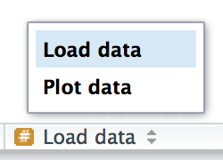

# R Style {#sec-day-1-style}

```{r}
#| echo: false
source("_common.R")
```

Good coding style is like correct punctuation: you can manage without it, butitsuremakesthingseasiertoread. Even as a very new programmer, it's a good idea to work on your code style. Using a consistent style makes it easier for others (including future-you!) to read your work and is particularly important if you need to get help from someone else. This chapter will introduce the most important points of the [tidyverse style guide](https://style.tidyverse.org), which is used throughout this book.

Styling your code will feel a bit tedious to start with, but if you practice it, it will soon become second nature. Additionally, there are some great tools to quickly restyle existing code, like the [**styler**](https://styler.r-lib.org) package by Lorenz Walthert. Once you've installed it with `install.packages("styler")`, an easy way to use it is via RStudio's **command palette**. The command palette lets you use any built-in RStudio command and many addins provided by packages. Open the palette by pressing Cmd/Ctrl + Shift + P, then type "styler" to see all the shortcuts offered by styler. @fig-styler shows the results.

```{r}
#| label: fig-styler
#| echo: false
#| out-width: null
#| fig-cap: | 
#|   RStudio's command palette makes it easy to access every RStudio command
#|   using only the keyboard.
#| fig-alt: |
#|   A screenshot showing the command palette after typing "styler", showing
#|   the four styling tool provided by the package.
knitr::include_graphics("screenshots/rstudio-palette.png")
```

We'll use the nycflights13 packages for code examples in this chapter.

```{r}
#| label: setup
#| message: false

if (!requireNamespace("styler", quietly = TRUE)) {
  # If not installed, install the package
  install.packages("styler")
}

if (!requireNamespace("nycflights13", quietly = TRUE)) {
  install.packages("nycflights13")
}

library(styler)
library(nycflights13)
```

## Names

Variable names should use only lowercase letters, numbers, and `_`. Use `_` to separate words within a name.

```{r}
#| eval: false
# Strive for:
short_flights <- flights[flights$air_time < 60, ]

# Avoid:
SHORTFLIGHTS <- flights[flights$air_time < 60, ]
```

As a general rule of thumb, it's better to prefer long, descriptive names that are easy to understand rather than concise names that are fast to type. Short names save relatively little time when writing code (especially since autocomplete will help you finish typing them), but it can be time-consuming when you come back to old code and are forced to puzzle out a cryptic abbreviation.

If you have a bunch of names for related things, do your best to be consistent. It's easy for inconsistencies to arise when you forget a previous convention, so don't feel bad if you have to go back and rename things. In general, if you have a bunch of variables that are a variation on a theme, you're better off giving them a common prefix rather than a common suffix because autocomplete works best on the start of a variable.

## Spaces

Put spaces on either side of mathematical operators apart from `^` (i.e. `+`, `-`, `==`, `<`, ...), and around the assignment operator (`<-`).

```{r}
#| eval: false
# Strive for
z <- (a + b)^2 / d

# Avoid
z<-( a + b ) ^ 2/d
```

Don't put spaces inside or outside parentheses for regular function calls. Always put a space after a comma, just like in standard English.

```{r}
#| eval: false
# Strive for
mean(x, na.rm = TRUE)

# Avoid
mean (x ,na.rm=TRUE)
```

## Sectioning comments

As your scripts get longer, you can use **sectioning** comments to break up your file into manageable pieces:

```{r}
#| eval: false
# Load data --------------------------------------

# Plot data --------------------------------------
```

RStudio provides a keyboard shortcut to create these headers (Cmd/Ctrl + Shift + R), and will display them in the code navigation drop-down at the bottom-left of the editor, as shown in @fig-rstudio-sections.

```{r}
#| label: fig-rstudio-sections
#| echo: false
#| out-width: null
#| fig-cap: | 
#|   After adding sectioning comments to your script, you can
#|   easily navigate to them using the code navigation tool in the
#|   bottom-left of the script editor.

```

## Summary

In this chapter, you've learned the most important principles of code style. These may feel like a set of arbitrary rules to start with (because they are!) but over time, as you write more code, and share code with more people, you'll see how important a consistent style is. And don't forget about the styler package: it's a great way to quickly improve the quality of poorly styled code.

In the next chapter, we switch back to data science tools, learning about tidy data. Tidy data is a consistent way of organizing your data frames that is used throughout the tidyverse. This consistency makes your life easier because once you have tidy data, it just works with the vast majority of tidyverse functions. Of course, life is never easy, and most datasets you encounter in the wild will not already be tidy. So we'll also teach you how to use the tidyr package to tidy your untidy data.
